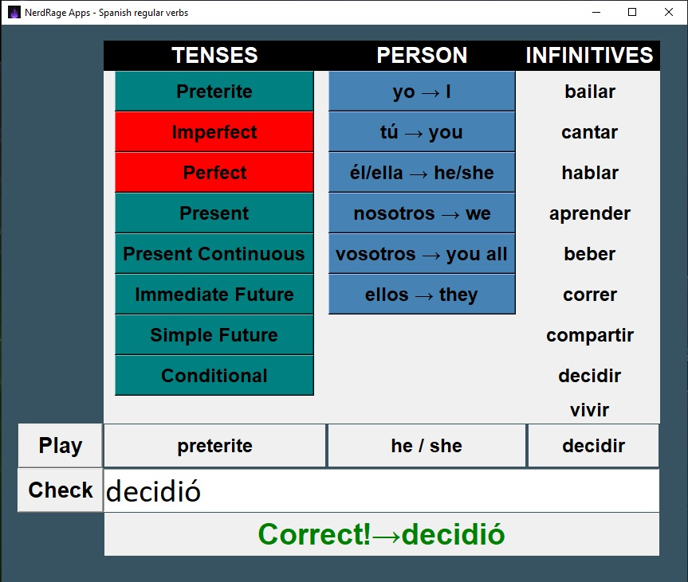

# Spanish Verbs Practice

### GUI app running Python code and using the Tkinter module.

Attached is a word file with the main Spanish tenses and a quick explanation on how to construct their regular forms.

The app will take a random Spanish verb (bailar, cantar, aprender, etc) and will ask you to form it in a specific tense (preterite, present, simple future, etc) in a specific person ('I' form, 'we' form, etc).

To make things easier for students (and for teachers who might want to use this app in class), you can deactivate whichever tenses you want; lets say you want to practice just the preterite and the imperfect tenses, so you click on all other tenses and they will show red.

Furthermore, you can choose for the app to only ask you for the 'I' form of whichever tenses are active.

If you can't get the right answer, the app will show you after three incorrect attempts.

Event binders have been included in order to speed the process: you can press the Enter key for the 'Check' button and the Enter key for the 'Play' button.

Enjoy!

